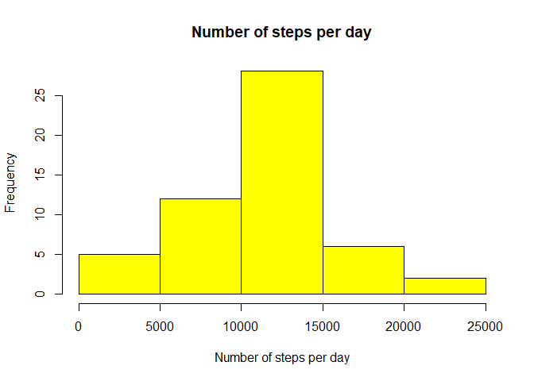
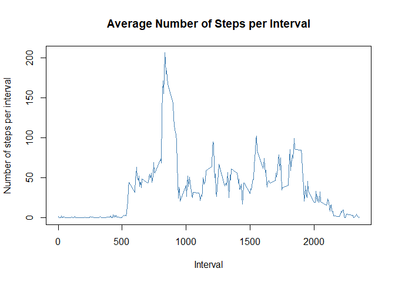
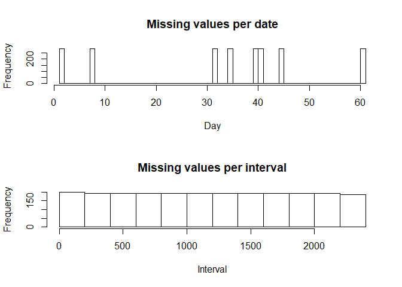
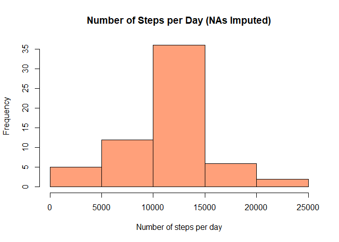
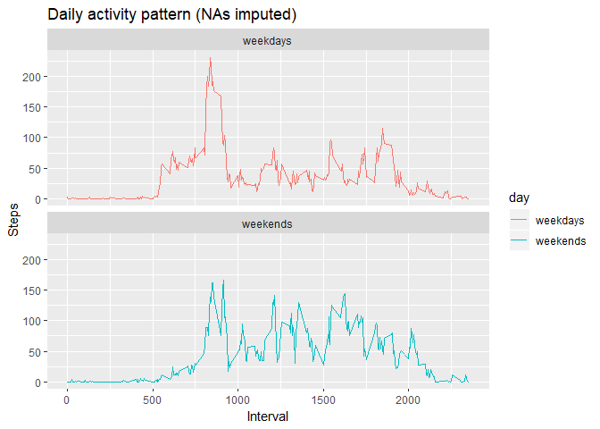

```r
library(knitr)
opts_chunk$set(echo=TRUE)
```

##1. Loading and Preprocessing Data

```r
activity <- read.csv("C://Users/tsc029/Desktop/R/repdata_data_activity/activity.csv", sep = ",", header = TRUE, na.strings = "NA" )
activity <- transform(activity,  date = factor(date))
```

##2. The mean number of steps taken per day


```r
aggActivity <- aggregate(steps~ date , data = activity, FUN = sum, na.rm = TRUE)
hist(aggActivity$steps, xlab = "Number of steps per day", ylab = "Frequency", main = "Number of steps per day", col = "yellow")
```

<!-- -->

###Average Number of Steps per Day

```r
MeanSteps <- mean(aggActivity$steps, na.rm = TRUE)
print(MeanSteps)
```

```
## [1] 10766.19
```

###Median Number of Steps per Day

```r
MedianSteps <- median(aggActivity$steps, na.rm = TRUE)
print(MedianSteps)
```

```
## [1] 10765
```

## 3. Average Daily Activity Pattern


```r
stepsPerInterval_mean <- aggregate(steps ~ interval, data = activity, FUN = mean, na.rm =TRUE)
plot(stepsPerInterval_mean$interval, stepsPerInterval_mean$steps, type = "l", xlab = "Interval", ylab = "Number of steps per interval", lwd = 1.5, col = "steelblue", main = "Average Number of Steps per Interval")
```

<!-- -->
### 5-minute interval with the maximum number of steps
 
Maximum average steps (no.) in an interval: 

```r
MaximumAverageSteps <- max(stepsPerInterval_mean$steps)
print(MaximumAverageSteps)
```

```
## [1] 206.1698
```
Interval (no.) with maximum average steps:


```r
MaximumAverageInterval  <- stepsPerInterval_mean$interval[which(stepsPerInterval_mean$steps == MaximumAverageSteps)]
print(MaximumAverageInterval)
```

```
## [1] 835
```

## 4. Imputing missing values

###The total number of missing values in the dataset (i.e. the total number of rows with NAs):

```r
sum(is.na(activity))
```

```
## [1] 2304
```

###Devise a strategy for filling in all of the missing values in the dataset. 


```r
NA_total <- subset(activity, is.na(steps))
par(mfrow = c(2,1))
#Missing values per date
hist(as.numeric(NA_total$date), breaks = 61, xlab = "Day", main = "Missing values per date")

#Missing values per interval
hist(NA_total$interval, xlab= "Interval", main = "Missing values per interval")
```

<!-- -->
Conclusion: As missing values are evenly distributed across intervals, but not for dates, filling in strategy by the former is applied. 

###Create a new dataset that is equal to the original dataset but with the missing data filled in.

```r
# Calculate mean of steps per interval
StepsPerInterval2_mean <- tapply(activity$steps, activity$interval, mean, na.rm = TRUE)

# Split the 'activity' dataset by 'with' and 'without NAs'
activity_NA <- activity[is.na(activity$steps),]
activity_wo_NA <- activity[!is.na(activity$steps),]

#Fill in missing values in activity_NAs by 
activity_NA$steps <- as.factor(activity_NA$interval)
levels(activity_NA$steps) <- StepsPerInterval2_mean

#Change the vector back as integer 
levels(activity_NA$steps) <- round(as.numeric(levels(activity_NA$steps)))
activity_NA$steps <- as.integer(as.vector(activity_NA$steps))

#Merge datasets 
imputed_activity <- rbind(activity_NA, activity_wo_NA)
```

###Make a histogram of the total number of steps taken each day


```r
activity_imp <- aggregate(steps~ date, data = imputed_activity, FUN = sum)
hist(activity_imp$steps, xlab = "Number of steps per day", ylab = "Frequency", main = "Number of Steps per Day (NAs Imputed)", col = "lightsalmon")
```

<!-- -->


###Calculate and report the mean and median total number of steps taken per day. Do these values differ from the estimates from the first part of the assignment?

###Average Number of Steps per Day (NAs imputed)

```r
AverageSteps_Imp <- mean(activity_imp$steps, na.rm = TRUE)
print(AverageSteps_Imp)
```

```
## [1] 10765.64
```

###Median Number of Steps per Day (NAs imputed)

```r
Imp_MedianSteps <- median(activity_imp$steps, na.rm = TRUE)
print(Imp_MedianSteps)
```

```
## [1] 10762
```

###What is the impact of imputing missing data on the estimates of the total daily number of steps?

The impact of imputing steps is minor, with a slight decrease in both mean and median number of steps per day. 

## 5. Are there differences in activity patterns between weekdays and weekends?

###Create a new factor variable in the dataset with two levels - "weekday" and "weekend" indicating whether a given date is a weekday or weekend day.

```r
# 'day' variable with levels 'weekday' and 'weekend' added to dataset 
#elseif function to categorize Saturday and Sunday as factor level "weekend", all the rest as "weekday"

imputed_activity$day<- ifelse(as.POSIXlt(imputed_activity$date)$wday %in% c(0,6), "weekends","weekdays")

#Factorization of 'day'
imputed_activity$day <- factor(imputed_activity$day)
```

###Make a panel plot containing a time series plot of the 5-minute interval (x-axis) and the average number of steps taken, averaged across all weekday days or weekend days (y-axis). 

```r
#Aggregate mean steps per intervall and Weekday/Weekend
day_interval_steps <- aggregate(steps~ interval + day, data = imputed_activity, FUN = mean)
#Inspect data frame
head(day_interval_steps)
```

```
##   interval      day      steps
## 1        0 weekdays 2.28888889
## 2        5 weekdays 0.40000000
## 3       10 weekdays 0.15555556
## 4       15 weekdays 0.17777778
## 5       20 weekdays 0.08888889
## 6       25 weekdays 1.57777778
```

```r
#Make plot
library(ggplot2)
g <- ggplot(day_interval_steps, aes(x=interval, y=steps, col = day))
g+  geom_line()+  
  facet_wrap(~ day, ncol = 1, nrow = 2)+
  labs(title = "Daily activity pattern (NAs imputed)")+  
  labs(x= "Interval")+  labs(y= "Steps")
```

<!-- -->

